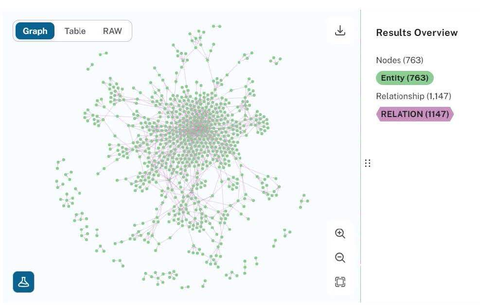

<br/>
<p align="center">
  <h3 align="center">Knowledge Graph Using BioBERT</h3>

</p>

    

## Table Of Contents

* [About the Project](#about-the-project)
* [Built With](#built-with)
* [Getting Started](#getting-started)
  * [Prerequisites](#prerequisites)
  * [Installation](#installation)
* [Usage](#usage)
* [Contributing](#contributing)
* [License](#license)
* [Authors](#authors)
* [Acknowledgements](#acknowledgements)

## About The Project

 <p align="center">
    
  </p>

This repository includes code for Named Entity Recognition and Relationship Extraction methods and knowledge graph generation through EHR records. These methods were performed on n2c2 2018 challenge dataset which was augmented to include a sample of ADE corpus dataset. This project is capstone project for my undergraduate degree in Bachelors of Technology (Computer Science and Engineering).

The purpose of this project is to automatically structure this data into a format that would enable doctors and patients to quickly find information that they need. Specifically, build a Named Entity Recognition (NER) model that would recognize entities such as drug, strength, duration, frequency, adverse drug event (ADE), reason for taking the drug, route and form. Further, the model would also recognize the relationship between drugs and every other named entity as well and generate a knowledge graph based on it so as to make it easier for the doctors to analyze the patient’s disease and drug history at a quick glance. The model would also have the feature of query answering wherein the knowledge graph will be used to answer the user queries.

The main objective of the project is to use the extracted relationships between drugs and every other entity to build a comprehensive knowledge graph which could be used for providing quick summary, query answering and analysis, thus simplifying knowledge discovery in the biomedical field

## Built With


* [Python]()
* [JavaScript]()
* [HTML/CSS]()
* [FastAPI]()
* [Neo4J]()

## Getting Started

To run this project locally you need to get the datasets from the links mentioned below and preprocess the datasets to generate the dataset for training and testing of NER and RE models. Also you will need to have an Neo4J account for knowledge graph generation.

### Prerequisites

1. Datasets used for training.

```sh
https://huggingface.co/datasets/ade_corpus_v2
```

```sh
https://portal.dbmi.hms.harvard.edu/projects/n2c2-nlp/
```


2.  Neo4J Connection URI

```sh
https://neo4j.com/
```

3. Modules in requirements.txt
```sh
pip install -r requirements.txt
```

### Installation

1. Preprocess the datasets

```sh
python generate_data.py 
    --task ner 
    --input_dir data
    --ade_dir ade_corpus
    --target_dir dataset
    --max_seq_len 512 
    --dev_split 0.1 
    --tokenizer biobert-base 
    --ext txt 
    --sep " " 
```

* The task parameter can be either ner or re for Named Entity Recognition and Relation Extraction tasks respectively.
* The input directory should have two folders named train and test in them. Each folder should have txt and ann files from the original dataset.
* ade_dir is an optional parameter. It should contain json files from the ADE Corpus dataset.
* The max_seq_len should not exceed 512 for BioBERT model.
* For BioBERT model, use biobert-base as the tokenizer value.
* Use txt for the ext (extension) parameter and " " as the sep (seperator) parameter for NER, and tsv extension and tab as the seperator for RE.


2. Train the NER and RE Models

* NER Model
```sh
export SAVE_DIR=./output
export DATA_DIR=./dataset

export MAX_LENGTH=128
export BATCH_SIZE=16
export NUM_EPOCHS=5
export SAVE_STEPS=1000
export SEED=0

python run_ner.py 
    --data_dir ${DATA_DIR}
    --labels ${DATA_DIR}/labels.txt 
    --model_name_or_path dmis-lab/biobert-large-cased-v1.1 
    --output_dir ${SAVE_DIR}
    --max_seq_length ${MAX_LENGTH} 
    --num_train_epochs ${NUM_EPOCHS} 
    --per_device_train_batch_size ${BATCH_SIZE} 
    --save_steps ${SAVE_STEPS} 
    --seed ${SEED} 
    --do_train 
    --do_eval 
    --do_predict 
    --overwrite_output_dir
```
* RE Model

```sh
export SAVE_DIR=./output
export DATA_DIR=./dataset

export MAX_LENGTH=128
export BATCH_SIZE=8
export NUM_EPOCHS=3
export SAVE_STEPS=1000
export SEED=1
export LEARNING_RATE=5e-5

python run_re.py 
    --task_name ehr-re 
    --config_name bert-base-cased 
    --data_dir ${DATA_DIR} 
    --model_name_or_path dmis-lab/biobert-base-cased-v1.1 
    --max_seq_length ${MAX_LENGTH} 
    --num_train_epochs ${NUM_EPOCHS} 
    --per_device_train_batch_size ${BATCH_SIZE} 
    --save_steps ${SAVE_STEPS} 
    --seed ${SEED} 
    --do_train 
    --do_eval 
    --do_predict 
    --learning_rate ${LEARNING_RATE} 
    --output_dir ${SAVE_DIR} 
    --overwrite_output_dir
```

3. To start the app in development mode

```sh
uvicorn fast_api:app --reload
```

* To run the front-end, in front-end/ehr.html and open the HTML file in a browser.

## Usage

To show the operation of Named Entity Recognition (NER), Relationship Table and Knowledge Graph, a web app was developed using HTML, CSS, and JavaScript. A graphical user interface (GUI) is displayed, in which the user needs to upload an EHR from which entities, relationships have been identified based on which Knowledge graph is created. The retrieved entities can be viewed as a result. The relationship between retrieved entities can be viewed as a result. The Knowledge graph generated can be viewed as a result .
 <p align="center">
    
  </p>
 <p align="center">
    
  </p>

* The uploaded ehr's data is stored in the Neo4J graph database shown in the following figure.

   <p align="center">
    
  </p>

* The example for query-answering is shown in the following image.

   <p align="center">
    
  </p>


## Contributing

Contributions are what make the open source community such an amazing place to be learn, inspire, and create. Any contributions you make are **greatly appreciated**.
* If you have suggestions for adding or removing projects, feel free to [open an issue](https://github.com/vedants03/Knowledge_Graph_Using_BioBERT/issues/new) to discuss it, or directly create a pull request after you edit the *README.md* file with necessary changes.
* Please make sure you check your spelling and grammar.
* Create individual PR for each suggestion.

### Creating A Pull Request

1. Fork the Project
2. Create your Feature Branch (`git checkout -b feature/AmazingFeature`)
3. Commit your Changes (`git commit -m 'Add some AmazingFeature'`)
4. Push to the Branch (`git push origin feature/AmazingFeature`)
5. Open a Pull Request

## License

Distributed under the MIT License. See [LICENSE](https://github.com/vedants03/Knowledge_Graph_Using_BioBERT/blob/main/LICENSE.md) for more information.

## Authors

* **Vedant Shahu** - *Computer Science and Engineering Student* - [Vedant Shahu](https://github.com/vedants03) 

## Acknowledgements

* [Smit Kiri](https://github.com/smitkiri)
